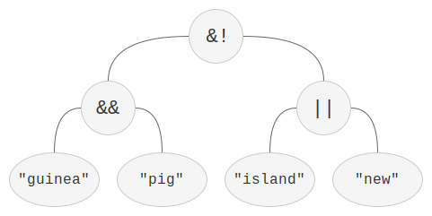

# Search Application

**INF1101 - Data Structures and Algorithms**  
**Obligatory Assignment 2, Semester of 2025**  
**UiT - The Arctic University of Norway**

In this assignment, you will implement a **Search Application**. Unlike the previous assignment where you implemented search functionality for singular words within a single document, this task will involve creating a more advanced search engine. Your application will support complex search queries over multiple documents using Boolean logic operators.

The most straight-forward way to achieve this functionality is to implement a data structure known as an [_inverted index_](https://en.wikipedia.org/wiki/Inverted_index). This data structure is far less defined than say a linked list or map, and largely depends on other data structures to function.

---

## Search Query Grammar

The syntax of the search queries follows the grammar rules defined by the following [_Backus-Naur Form_](https://en.wikipedia.org/wiki/Backus%E2%80%93Naur_form) (BNF):

```
query   ::= andterm | andterm "&!" query
andterm ::= orterm | orterm "&&" andterm
orterm  ::= term | term "||" orterm
term    ::= "(" query ")" | word
word    ::= <alphanumeric string>
```

The BNF grammar defines how search queries are structured and processed logically. By combining words with Boolean operators (&&, ||, &!) and using parentheses for grouping, users can express very specific search criteria, and your parser will break down these queries step by step to find the relevant documents.

---

### Explanation of Grammar Symbols

The symbols in the grammar represent the following logical operations:

- **`&!` (AND NOT)** – Returns any document that contains the left-hand operand but _not_ the right-hand operand.
- **`&&` (AND)** – Returns documents that contain _both_ operands.
- **`||` (OR)** – Returns documents that contain _either_ the left-hand or right-hand operand.
- **`()` (Parentheses)** – Groups queries. Any query enclosed in parentheses is evaluated first, and the result is used as a single operand in the larger expression.

You will need to parse these queries according to the BNF rules.

---

## Parser Implementation

We recommend implementing a **recursive descent parser**, where each rule in the grammar is represented by a single recursive function. The parsed expression should be represented as an **abstract syntax tree (AST)**.

In an AST:

- The **root** of each subtree represents a Boolean operator.
- The **leaf nodes** represent individual words (terms).
- **Internal nodes** represent Boolean operators (AND, OR, AND NOT) that are evaluated based on Boolean algebra, using set operations.

---

### Example Query & AST

Consider the following query:

```
(guinea && pig) &! (island || new)
```

This query would produce the following AST:



**Key Notes:**

- The query is parsed into a hierarchical AST structure.
- **Leaf nodes** in the tree represent sets of documents containing specific words (e.g., documents containing "guinea").
- **Internal nodes** apply Boolean operations on the sets (AND, OR, AND NOT), based on the corresponding query syntax.

---

## Executing Queries

The query will be executed by **traversing the AST**. During traversal:

- Each **leaf node** returns the set of documents that contain the corresponding word.
- **Internal nodes** perform set-based Boolean operations on their children nodes.

Boolean operations can be performed using set operations; **intersection**, **union**, and **difference**.

---

## Technical Details

### Precode Overview

```
├── README.md
├── Makefile
├── run.sh
├── create-archive.sh
├── data
│   └── enwiki.zip    // zip containing a large number of wikipedia articles as plaintext. See the README before expanding this archive.
├── doc
│   └── ... documents such as your report and this precept
├── include
│   ├── adt
│   │   ├── index.h   // The interface you will be implementing for. It is inadvisable to edit this.
│   │   ├── list.h
│   │   ├── map.h
│   │   └── set.h
│   └── ... other headers
└── src
    ├── adt
    │   ├── ... put any alternate implementations of the ADT's here (then set them as source in the Makefile)
    │   ├── doublylinkedlist.c
    │   ├── hashmap.c
    │   ├── index.c   // YOUR IMPLEMENTATION OF THE INDEX INTERFACE
    │   └── rbtreeset.c
    ├── common.c
    ├── main.c
    └── ... misc. source files (automatically found by the Makefile, put general-purpose sources here)
```

The directory structure is designed to allow you to easily swap between implementations of the various headers.

For your convenience, we have included a `run.sh` command just as with the previous assignments. You should however also be comfortable with typing out arguments manually.

**Note that the map interface is changed from the previous assignment, to better support nested maps.** You should become aquainted with it.

---

## Getting Started

We have tried our best to provide meaningful doctexts for the defined headers. You should read this documentation before using a function, as it might not behave as you expect.

Starting out, you should make a plan regarding how your structure should be laid out. Consider what you will receive as input (queries), and what you should provide as response (documents). Diagrams and/or drawings are highly useful here, and is something you may include in your report as well once you complete the assignment.

There are an infinite number of ways to implement the index structure, but you should expect to utilize nested structures, such as sets of maps, maps of lists, and so on.

---

## Compilation & Usage

Refer to the provided `README.md` for detailed instructions on how to compile and run the application. We strongly advice reading it carefully before starting the assignment.

---

### Delivery

Your report must be in pdf format, and be located in the `doc/` folder. Follow the naming schema of `abc123-report.pdf`, where you replace `abc123` with your UiT identifier.  
For your convenience, we have include the `create-archive.sh` script. This script will create an archive of your current working directory, all while excluding system files, data files, etc.

**Including data files in the delivered zip will result in an automatic fail and use of an attempt.**

